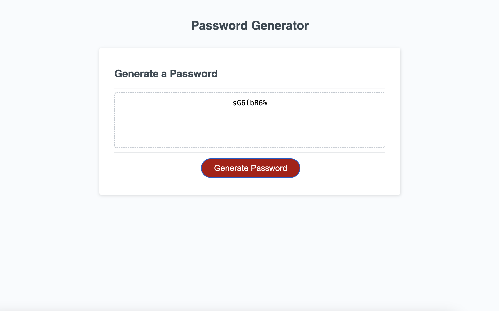

# Password Generator

## Description

This project is the implementation of JavaScript for a password generator. It starts by asking the user a series of questions on how long the password should be, and what characters can be included. The program uses a function to generate a password of the desired length with the desired character types.

Working on this project was a great way to try out many of the concepts covered in class, particulary the various methods for arrays, such as the .join and .push. I had a lot of fun with this one, and can see myself returning in the future to improve the generator, perhaps introducing a means of randomising the position of the characters, allowing for further encryption.

## Installation

No installation necessary. Please visit https://alex-quayle.github.io/password-generator/ to view the webpage. Below is a screenshot of the deployed page:

## Credits

### Learning Resources Utilised

The HTML and CSS for this project was provided by edX. Additionally, the arrays and implementation past line 148 was also provided by the bootcamp team.

In addition to the following links, the class sessions held by the edX front-end bootcamp team have been invaluable for this challenge in my understanding of how to install, use and customise Bootstrap 5.

> Mozilla Developers Network (2023, August 9). do...while. https://developer.mozilla.org/en-US/docs/Web/JavaScript/Reference/Statements/do...while.

> Mozilla Developers Network (2023, September 14). Array.prototype.join(). https://developer.mozilla.org/en-US/docs/Web/JavaScript/Reference/Global_Objects/Array/join.

> Autocode. (2021, December 18). How to get a random item from a JavaScript array | Intro to JavaScript. https://www.youtube.com/watch?v=YNPhn5WkSbM.
